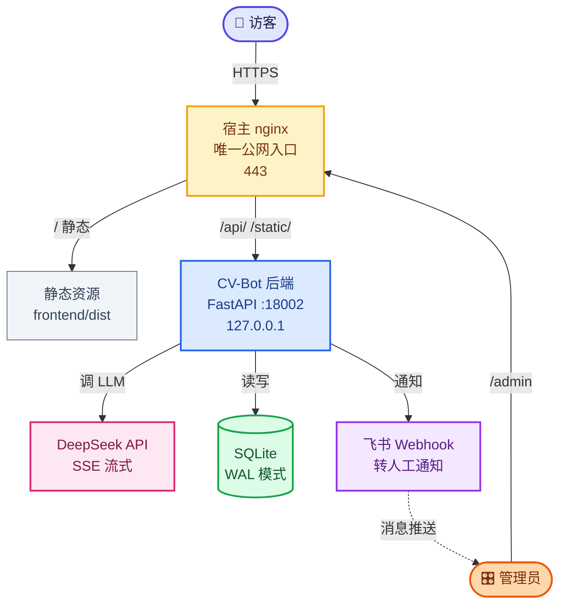
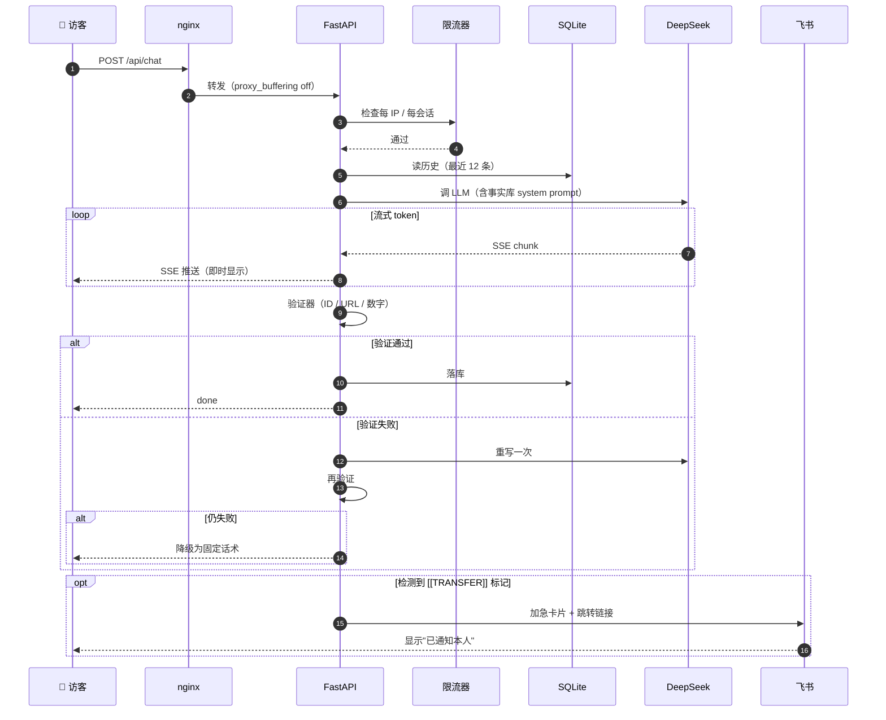
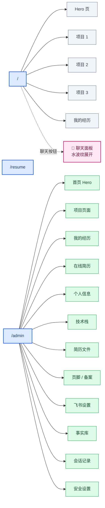

# CV-Bot

> 会对话的简历 · 一个部署在个人主页首屏的 AI 简历机器人

面试官打开链接，不用滚动、不用找邮箱，**直接跟 AI 对话**就能了解你的项目经历、技术栈、可公开背景。问到不确定的内容，自动转本人飞书确认。

---

## ✨ 核心特性

| 特性 | 说明 |
|---|---|
| 🎯 **不做 RAG** | 简历语料只有几千字，全量注入 system prompt 比向量检索更准、更省 250MB 内存、少一个故障点 |
| 🛡 **确定性验证器** | 引用 ID / URL / ≥4 位数字必须来自事实库；不合规自动重写一次，再失败降级为固定话术 |
| ⚡ **SSE 流式对话** | 比 WebSocket 简单，nginx 少三段易错配置；前端支持打断 |
| 💬 **水波纹展开的聊天面板** | 从按钮位置扩散到屏幕中央，背景虚化 |
| 📱 **5 页翻页门面** | Hero + 3 项目 + 经历，scroll-snap 吸附 + 逐项渐入 |
| 🎛 **管理后台** | 12 个 tab，内容配置、媒体上传、会话记录、一键接管、密码修改 |
| 📩 **飞书转人工** | AI 识别商务意图自动通知，带跳转链接直达会话 |
| 🔒 **密码登录** | PBKDF2 加密存储，不存明文，可在后台改密码 |
| 🐳 **Docker 化** | 一键起容器，端口绑 `127.0.0.1` 不暴露 |

---

## 🏗 架构

### 系统总览



### 请求链路（转人工场景）



### 前端页面结构



---

## 🚀 快速开始

### 前置

- Python 3.12+
- Node.js 18+
- DeepSeek API key（[申请地址](https://platform.deepseek.com)）
- 飞书群机器人 webhook（可选）

### 后端

```bash
cd backend
python -m venv .venv
source .venv/bin/activate          # Windows: .venv\Scripts\activate
pip install -r requirements.txt

# 1. 配置环境变量
cp .env.example .env
# 编辑 .env，填 DEEPSEEK_API_KEY

# 2. 配置事实库
cp facts/facts.yaml.example facts/facts.yaml
# 编辑 facts.yaml，填你的真实信息

# 3. 起服务
uvicorn app.main:app --reload --host 127.0.0.1 --port 8000
```

打开 http://127.0.0.1:8000/docs 看接口文档。

### 前端

```bash
cd frontend
npm install
npm run dev
```

打开 http://localhost:5173

### 管理后台

- 地址：http://localhost:5173/admin
- 首次登录密码：`backend/.env` 里的 `ADMIN_TOKEN`
- 登录后到「安全设置」改密码

### 跑测试（0 API 消耗）

```bash
cd backend
pytest -v
```

所有 LLM 调用都被 mock，26+ 用例全绿。

---

## 🧠 技术选型说明

### 为什么不做 RAG？

| | 向量 RAG | 全量注入 + 引用 ID |
|---|---|---|
| 准确率 | 中（可能检索不到） | 高（语料都在上下文里） |
| 内存 | +250 MiB（Chroma/FAISS） | ~0 |
| 故障点 | 检索失败、索引损坏 | 无 |

简历只有几千字，RAG 在这里是**过度设计**。全量注入反而更准，还能省内存，面试时也是加分项——能说清"为什么这里不该上 RAG"。

### 为什么用 SSE 而不是 WebSocket？

| | WebSocket | SSE |
|---|---|---|
| 方向 | 双向 | 单向（服务器→浏览器） |
| nginx | 要配 Upgrade + Connection + 长超时 | 普通反代即可 |
| 断线重连 | 自己写 | 浏览器自动 |
| 打断 | 天然 | POST + abort |

主要需求是**流式接收 AI 输出**，用户发消息是低频的。SSE 用普通 HTTP，nginx 少三段易错配置，代码也少。

### 为什么单 worker？

会话有状态（`_cancel_events`、`hub` 的订阅表在内存里）。多 worker 会导致同一会话被路由到不同进程，互相看不到连接。要扩就得上 Redis pub/sub，得不偿失。个人简历站单 worker 完全够。

### 为什么验证器要硬拦截？

不是"提示用户可能不准"，而是**不合规直接不放行**：重写一次，再失败降级为固定话术。这是把"防幻觉"从**提示**变成**保证**。

### 为什么前后端双层消毒？

- **前端 DOMPurify**（主防线）：AI 输出 → marked 转 HTML → DOMPurify 消毒
- **后端 bleach**（二次兜底）：万一日志、导出或其他途径漏出去，二次过滤

因为 AI 输出**属于不可信内容**，绝不能直接 `v-html`。

---

## 📁 目录结构

```
CV-Bot/
├── backend/
│   ├── app/
│   │   ├── main.py              # FastAPI 入口 + 静态挂载
│   │   ├── config.py            # .env 读取
│   │   ├── db.py                # SQLite WAL + 表结构 + 管理员密码
│   │   ├── auth.py              # 管理员鉴权（session token）
│   │   ├── routers/
│   │   │   ├── chat.py          # POST /api/chat（SSE 流）
│   │   │   ├── cancel.py        # 打断
│   │   │   ├── session.py       # 历史 / 导出 / 删除
│   │   │   ├── contact.py       # 转人工
│   │   │   ├── site.py          # 公开配置 + 简历下载
│   │   │   ├── admin.py         # 后台全接口
│   │   │   └── events.py        # 访客常驻 SSE（接管用）
│   │   ├── services/
│   │   │   ├── llm.py           # DeepSeek 流式调用
│   │   │   ├── facts.py         # 事实库加载 + prompt 生成
│   │   │   ├── verifier.py      # 确定性验证器
│   │   │   ├── sanitize.py      # HTML 消毒（二次兜底）
│   │   │   ├── feishu.py        # 飞书通知（分级）
│   │   │   ├── site_config.py   # 站点配置 KV + merge
│   │   │   └── hub.py           # 会话事件分发
│   │   └── middleware/
│   │       └── ratelimit.py     # 内存限流
│   ├── facts/
│   │   └── facts.yaml.example   # 事实库模板
│   ├── tests/                    # pytest，全 mock
│   ├── requirements.txt
│   └── Dockerfile
├── frontend/
│   ├── src/
│   │   ├── App.tsx              # 路由分发
│   │   ├── api.ts               # SSE 消费 + fetch 封装
│   │   ├── hooks/useChat.ts     # 会话状态机 + EventSource
│   │   ├── components/          # 页面组件
│   │   ├── admin/               # 后台组件
│   │   ├── utils/markdown.ts    # marked + DOMPurify
│   │   └── styles.css
│   ├── package.json
│   ├── vite.config.ts
│   └── Dockerfile
├── docker-compose.yml
└── README.md
```

---

## 🔧 环境变量

| 变量 | 默认 | 说明 |
|---|---|---|
| `DEEPSEEK_API_KEY` | — | **必填** |
| `DEEPSEEK_BASE_URL` | `https://api.deepseek.com` | API 地址 |
| `DEEPSEEK_MODEL` | `deepseek-chat` | 模型 |
| `DAILY_BUDGET_CNY` | `10` | 全局日预算上限（元） |
| `RATE_LIMIT_PER_IP_PER_MIN` | `20` | 每 IP 每分钟 |
| `SESSION_TOKEN_DAILY_CAP` | `50000` | 单会话每日 token 上限 |
| `LLM_CONCURRENCY` | `3` | 并发上限 |
| `LLM_TIMEOUT_SEC` | `60` | LLM 超时 |
| `DB_PATH` | `./data/cvbot.db` | SQLite 路径 |
| `FACTS_PATH` | `./facts/facts.yaml` | 事实库路径 |
| `FEISHU_WEBHOOK_URL` | — | 飞书 webhook（也可在后台改） |
| `ADMIN_TOKEN` | — | 首次登录的初始密码 |
| `FRONTEND_ORIGIN` | `http://localhost:5173` | CORS 白名单 |

---

## 🐳 部署

### Docker

```bash
cd backend
docker build -t cvbot-backend .
docker run -d \
  --name cvbot \
  --restart unless-stopped \
  -p 127.0.0.1:18002:8000 \
  -v $(pwd)/data:/app/data \
  -v $(pwd)/static:/app/static \
  --env-file .env \
  cvbot-backend
```

### nginx 关键配置

```nginx
server {
    listen 443 ssl;
    server_name 你的域名;

    # 1. 静态资源
    root /opt/apps/CV-Bot/frontend/dist;
    location / { try_files $uri $uri/ /index.html; }

    # 2. API
    location /api/ {
        proxy_pass http://127.0.0.1:18002/;
        proxy_set_header Host $host;
        proxy_set_header X-Real-IP $remote_addr;
        proxy_set_header X-Forwarded-For $proxy_add_x_forwarded_for;
        proxy_set_header X-Forwarded-Proto $scheme;
        # SSE 关键：禁用缓冲
        proxy_buffering off;
        proxy_cache off;
    }

    # 3. 上传的媒体
    location /static/ {
        proxy_pass http://127.0.0.1:18002/static/;
    }
}
```

**没有 `proxy_buffering off` 的话 SSE 会被 nginx 缓存，看不到流式效果。**

---

## 🔒 安全

- ✅ **限流**：每 IP 20 次/分钟 + 单会话上限 + 全局日预算（默认 ¥10）
- ✅ **XSS**：前端 DOMPurify + 后端 bleach 双层
- ✅ **Prompt 注入**：事实库与系统提示隔离，输出仍过验证器
- ✅ **管理员鉴权**：PBKDF2 加密，session token 7 天
- ✅ **端口绑定**：`127.0.0.1`，不暴露公网
- ✅ **.gitignore**：`.env`、`data/`、`static/`、`facts.yaml` 全部忽略

---

## 📄 License

MIT
